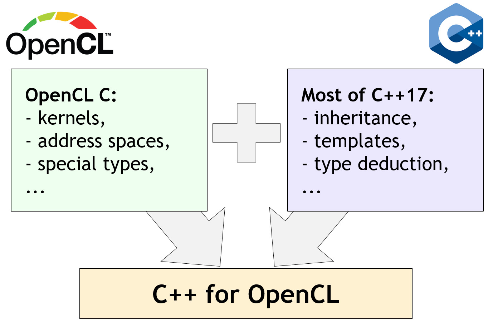

# C++ for OpenCL

The OpenCL working group has transitioned from the original OpenCL C++ kernel language first defined in OpenCL 2.1 to the community developed [C++ for OpenCL](https://www.iwocl.org/wp-content/uploads/iwocl-syclcon-2020-stulova-13-slides.pdf) kernel language that provides improved features and compatibility with OpenCL C.

C++ for OpenCL enables developers to use most C++17 features in a kernel code while keeping familiar OpenCL constructs, syntax, and sematic from OpenCL C. This facilitates smooth transition to new C++ features in existing OpenCL applications and does not require changing familiar development flow or tools. The main design goal of C++ for OpenCL is to reapply OpenCL-specific concepts to C++ in the same way as OpenCL C does. Aside from minor exceptions OpenCL C is a valid subset of C++ for OpenCL. Overall, the kernel code written in C++ for OpenCL looks just like code written in OpenCL C with some extra C++ features available for convenience. 

<p align="center">
<br>

<br> <br>
  <b>C++ for OpenCL Brings Together the Capabilities of OpenCL and C++17</b>
<br> <br>
</p>

Experimental support for C++ for OpenCL was added in [Clang 9](https://releases.llvm.org/9.0.0/tools/clang/docs/LanguageExtensions.html#opencl-features) with bug fixes and improvements in [Clang 10](https://releases.llvm.org/10.0.0/tools/clang/docs/ReleaseNotes.html#opencl-kernel-language-changes-in-clang).

You can check out C++ for OpenCL in [Compiler Explorer](https://godbolt.org/z/NGZw9U).

## Documentation

The language documentation can be found in releases of [OpenCL-Docs](https://github.com/KhronosGroup/OpenCL-Docs/releases) with [the first official](https://github.com/KhronosGroup/OpenCL-Docs/releases/tag/cxxforopencl-v1.0-r1) of version 1.0 (see also [the latest WIP version](OpenCL](https://github.com/KhronosGroup/Khronosdotorg/blob/master/api/opencl/assets/CXX_for_OpenCL.pdf).

This documentation provides details about the language semantic as well as differences to OpenCL C and C++.

## Example

The following code is a snippet illustrating how to implement kernels with complex number arithmetic using C++ features.

```cpp
// This example demonstrates a convenient way to implement
// kernel code with complex number arithmetic using various
// C++ features.

// Define a class - Complex, that can perform complex number
// computations with various precision when different
// types for T are used - double, float, half...
template<typename T>
class complex_t {
T m_re; // Real component.
T m_im; // Imaginary component.

public:
complex_t(T re, T im): m_re{re}, m_im{im} {};
complex_t operator*(complex_t &other)	
{
  return {m_re * other.m_re - m_im * other.m_im,
           m_re * other.m_im + m_im * other.m_re};
}
int get_re() { return m_re; }
int get_im() { return m_im; }
};

// A helper function to compute multiplication over
// complex numbers read from the input buffer and
// to store the computed result into the output buffer.
template<typename T>
void compute_helper(global T *in, global T *out) {
  auto idx = get_global_id(0);	
  // Every work-item uses 4 consecutive items from the input
  // buffer - two for each complex number.
  auto offset = idx * 4;
  complex_t num1{in[offset], in[offset + 1]};
  complex_t num2{in[offset + 2], in[offset + 3]};
  // Perform complex number multiplication.
  complex_t res = num1 * num2;
  // Every work-item writes 2 consecutive items to the output
  // buffer.
  out[idx * 2] = res.get_re();
  out[idx * 2 + 1] = res.get_im();
}

// This kernel can be used for complex number multiplication
// in single precision.
kernel void compute_sp(global float *in, global float *out) {
  compute_helper(in, out);
}

// This kernel can be used for complex number multiplication
// in half precision.
#pragma OPENCL EXTENSION cl_khr_fp16: enable
kernel void compute_hp(global half *in, global half *out) {
  compute_helper(in, out); 
}
```

## Developing kernels with C++ for OpenCL

C++ for OpenCL sources can be developed and compiled just like OpenCL C sources. However due to the increased growth of application complexity especially those that benefit most from rich variety of C++ features and high-level abstractions, it is expected that the majority of C++ for OpenCL kernels will be compiled offline. The offline compilation also provides ability to take advantage of various newest features in open source tools and frameworks without waiting for their integration into the vendor toolchains. 

### Offline compilation

Clang provides support for C++ for OpenCL using regular interface as for any version of OpenCL C. More details can be found in its [UsersManual](https://clang.llvm.org/docs/UsersManual.html#cxx-for-opencl). In the majority of cases the generated binary can be used in the existing drivers. C++ for OpenCL version 1.0 is developed against OpenCL 2.0. Depending on the features used drivers from other versions (e.g. OpenCL 3.0) might be able to load the binaries produced with C++ for OpenCL v1.0 too. Use of global objects and static function objects with non-trivial constructors is not supported in a portable way, refer to [the following clang documentation](https://clang.llvm.org/docs/UsersManual.html#constructing-and-destroying-global-objects) for details.

Clang only supports limited number of vendors and therefore to allow executing the binaries from C++ for OpenCL on more devices it is recommended to generate portable executable formants. C++ for OpenCL kernel sources can be compiled into SPIR-V using [open source tools](os_tooling.md) and then loaded into drivers supporting SPIR-V. C++ for OpenCL 1.0 generates SPIR-V 1.0 plus SPIR-V 1.2 where necessary.

The bugs and implementation of new features in clang can be tracked via the [OpenCL Support Page](https://clang.llvm.org/docs/OpenCLSupport.html#c-for-opencl-implementation-status).

### Online compilation

Kernel written in C++ for OpenCL can be compiled online on devices that support the following extension [cl_ext_cxx_for_opencl](https://www.khronos.org/registry/OpenCL/extensions/ext/cl_ext_cxx_for_opencl.html).

## Libraries

All OpenCL C builtin library functions are available with C++ for OpenCL.

There is work ongoing to provide C++ based libraries extended from C++ implementation: check out [experimental libraries in clang](https://clang.llvm.org/docs/OpenCLSupport.html#c-libraries-for-opencl) and [libclcxx](https://github.com/KhronosGroup/libclcxx) project for more details.

## Extensions

All extensions from OpenCL C are available with C++ for OpenCL.

## Contributions

C++ for OpenCL is a community driven open languages and contributions are welcome from anyone interested to improve the language compilation in [clang](https://clang.llvm.org/docs/OpenCLSupport.html) or documentation of the language hosted in [OpenCL-Docs](https://github.com/KhronosGroup/OpenCL-Docs). Refer to `git log` or `git blame` to find relevant contributors to contact or loop in for reviews.
