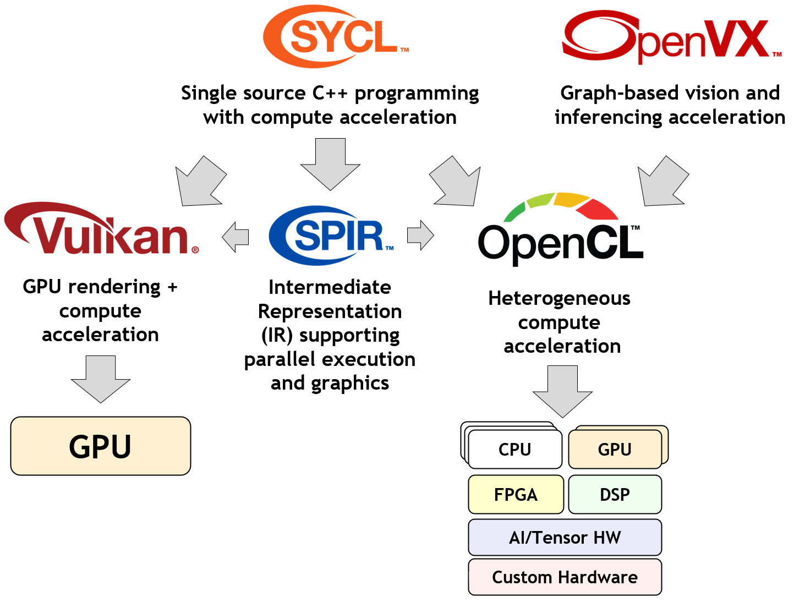

# How Does OpenCL Compare to Other Khronos Standards?

There is increasing industry interest in parallel processing acceleration for demanding desktop, mobile and embedded applications to combat the ‘End of Moore’s Law’ as processor frequency scaling gives way to parallel programming as the most effective way to deliver needed performance at acceptable levels of cost and power. The Khronos Group has several open standards related to parallel programming and GPU acceleration, with complementary strengths that may appeal to different developers. In many cases these different APIs may be used together.

Khronos has two high-level standards that focus on ease of programming with effective performance portability across multiple hardware architectures. This includes [SYCL](https://www.khronos.org/sycl/), which enables code for heterogeneous processors to be written in a “single-source” file using completely standard C++, and [OpenVX](https://www.khronos.org/openvx/) that enables vision and inferencing functionality to be expressed as a graph for optimized, portable acceleration on a wide range of hardware.

 

   
  <b>How OpenCL Relates to Other Khronos Acceleration Standards</b>
   

SYCL and OpenVX implementations can be accelerated over lower level Khronos APIs such as Vulkan and OpenCL – though that is not mandated. Both Vulkan and OpenCL provide lower-level, explicit access to hardware resources for maximum flexibility and control. 

[Vulkan](https://www.vulkan.org/) is a widely used new generation GPU API that can accelerate compute operations on any compatible GPU using compute shaders (shaders are the graphics equivalent of OpenCL's kernels), as well as rendering 3D graphics. When comparing OpenCL and GPU APIs such as Vulkan, some developers that are just interested in compute find that OpenCL provides a more straightforward programming model, a lighter weight runtime, more language flexibility compared to graphics shading languages - for example OpenCL C has pointers - and more rigorously defined numerical precision for math operations that can be critical for many applications. And of course, Vulkan can only be used to program GPUs, whereas OpenCL can be used to program heterogeneous accelerators.

Vulkan and many implementations of OpenCL use Khronos’ [SPIR-V](https://www.khronos.org/spir/) standard as a programming language intermediate representation that enables significant language compiler tooling flexibility.

