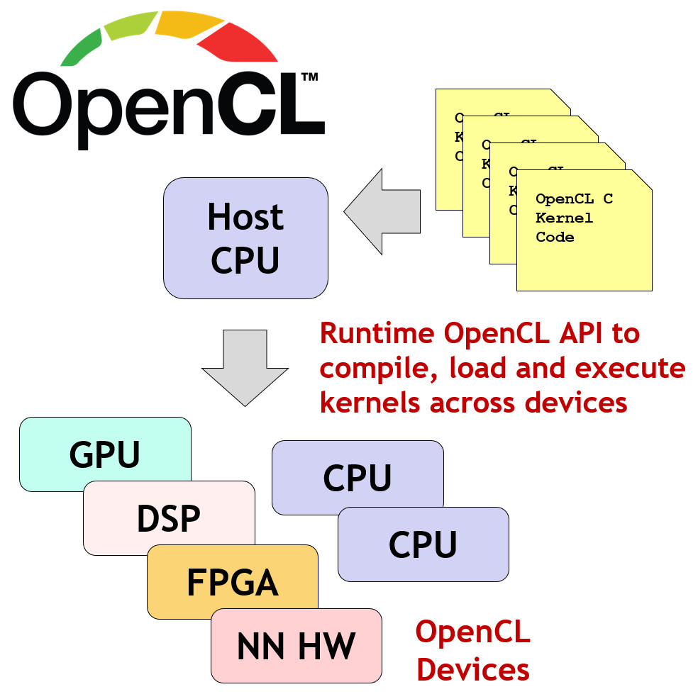
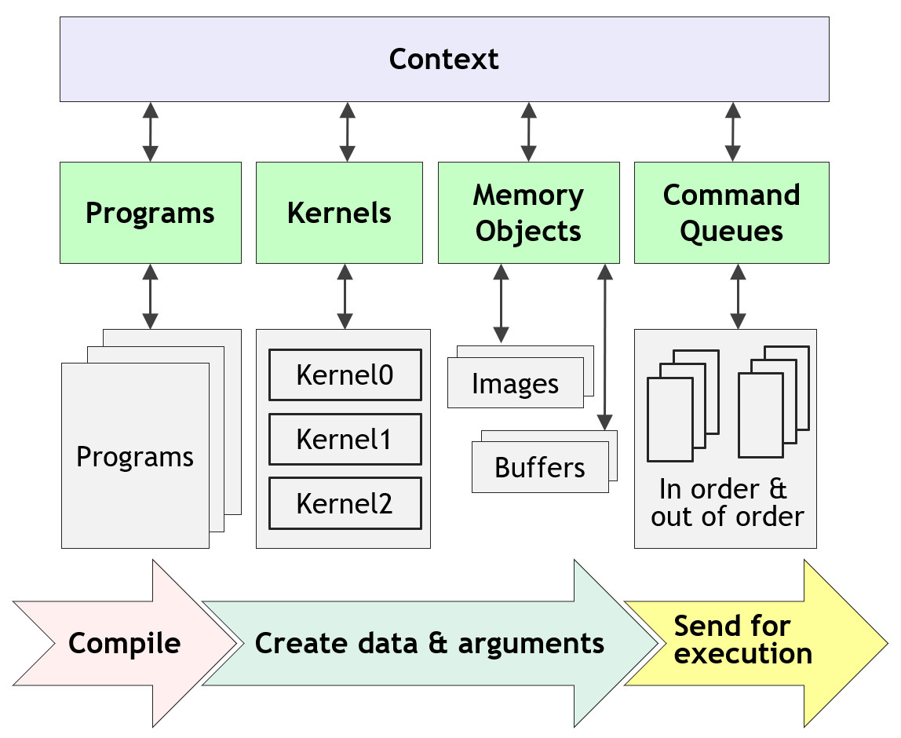

# How Does OpenCL Work?

OpenCL is a programming framework and runtime that enables a programmer to
create small programs, called *kernel programs* (or *kernels*), that can be
compiled and executed, in parallel, across any processors in a system. The
processors can be any mix of different types, including CPUs, GPUs, DSPs, FPGAs
or Tensor Processors - which is why OpenCL is often called a solution for
*heterogeneous* parallel programming.

The OpenCL framework contains two APIs. The *Platform Layer API* is run on the
*host CPU* and is used first to enable a program to discover what parallel
processors or *compute devices* are available in a system. By querying for what
compute devices are available an application can run portably across diverse
systems - adapting to different combinations of accelerator hardware. Once the
compute devices are discovered, the Platform API enables the application to
select and initialize the devices it wants to use.

The second API is the *Runtime API* which enables the application's kernel
programs to be compiled for the compute devices on which they are going to run,
loaded in parallel onto those processors and executed. Once the kernel programs
finish execution the Runtime API is used to gather the results.

   
  <b>Compiling and Executing OpenCL Kernels</b>
   

The most commonly used language for programming the kernels that are compiled
and executed across the available parallel processors is called *OpenCL C*.
OpenCL C is based on C99 and is defined as part of the OpenCL specification.
Kernels written in other programming languages may be executed using OpenCL by
compiling to an intermediate program representation, such as
[SPIR-V](https://www.khronos.org/spir/).

OpenCL is a low-level programming framework so the programmer has direct,
explicit control over where and when kernels are run, how the memory they use is
allocated and how the compute devices and host CPU synchronize their operations
to ensure that data and computed results flow correctly - even when the host and
compute kernels are running in parallel.

## Executing an OpenCL Program

OpenCL regards a *kernel* program as the basic unit of executable code (similar
to a C function). Kernels can execute with data or task-parallelism. An OpenCL
*program* is a collection of kernels and functions (similar to dynamic library
with run-time linking).

An OpenCL *command queue* is used by the host application to send kernels and
data transfer functions to a device for execution. By *enqueueing* commands into
a command queue, kernels and data transfer functions may execute asynchronously
and in parallel with application host code.

The kernels and functions in a command queue can be executed in-order or
out-of-order. A compute device may have multiple command queues.

   
  <b>Sequence for Executing OpenCL Kernels</b>
   

A complete sequence for executing an OpenCL program is:

1. Query for available OpenCL platforms and devices

2. Create a context for one or more OpenCL devices in a platform

3. Create and build programs for OpenCL devices in the context

4. Select kernels to execute from the programs

5. Create memory objects for kernels to operate on

6. Create command queues to execute commands on an OpenCL device

7. *Enqueue* data transfer commands into the memory objects, if needed

8. *Enqueue* kernels into the command queue for execution

9. *Enqueue* commands to transfer data back to the host, if needed
