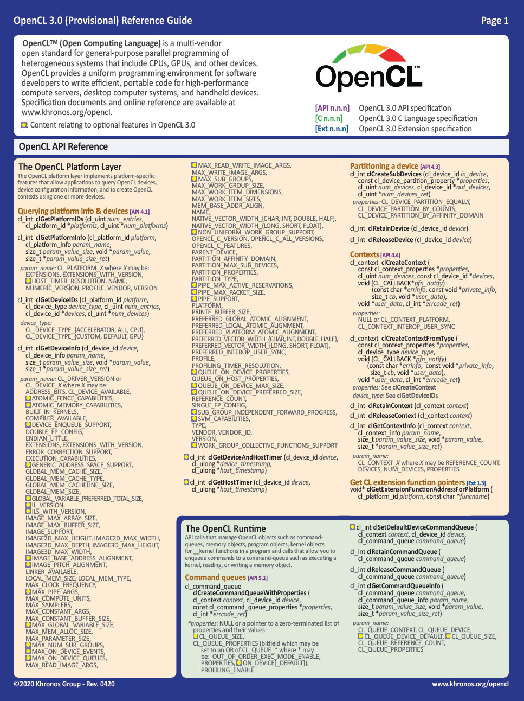

# OpenCL 3.0

OpenCL 3.0 makes the OpenCL ecosystem much more flexible by enabling vendors to focus their resources on functionality that their customers need. This is achieved by slicing all functionality beyond OpenCL 1.2 into optional features that can be queried in the API, with macros to indicate whether optional OpenCL C language features are present. This flexibility sets the stage for new extensions that becomes widely useful to be incrementally integrated into new OpenCL core specifications.

OpenCL 3.0 officially removed the OpenCL C++  language from the specification, and recommends the [C++ for OpenCL](https://github.com/KhronosGroup/Khronosdotorg/blob/main/api/opencl/assets/CXX_for_OpenCL.pdf) front end compiler for those developers that wish to use C++17 for writing kernel programs.

Developers will find OpenCL 3.0 much easier to use as it uses a unified specification that describes all versions of OpenCL in one place rather than having a separate specification per version, making it much easier for  developers to navigate as well as making it much easier to consistently apply specification fixes and clarifications. The unified OpenCL 3.0 specification also describes the rationale behind the specification's evolution.

The [source of the OpenCL 3.0 specification](https://github.com/KhronosGroup/OpenCL-Docs) is hosted on the Khronos GitHub for easy access, and the OpenCL Working Group welcomes community bug reports and pull requests to help improve the specification for everyone. 

 

   
  <b>The OpenCL 3.0 Reference Guide</b>
   

The OpenCL Working Group has also constructed a summary of the OpenCL 3.0 specification into a condensed *Reference Guide* that can be [downloaded as a PDF](https://www.khronos.org/files/opencl30-reference-guide.pdf).

## Moving Applications to OpenCL 3.0

If you have existing applications running on any older version of OpenCL, using OpenCL 3.0 is straightforward.

* Applications using OpenCL 1.2 will run unchanged on any OpenCL 3.0 device as all OpenCL 1.2 functionality will work on any OpenCL 3.0 driver with no code changes.
* OpenCL 2.X applications will also continue to work on OpenCL 3.0 with no code changes *if* the OpenCL 3.0 driver supports all the functionality used by the application. If you are running on a device that upgrades its drivers from 2.X to 3.0 it would be expected that all functionality will continue to be supported and so no application changes will be needed.
* Applications that wish to run portably across multiple OpenCL 3.0 devices, and use OpenCL 2.X-level features, are strongly encouraged to query to ensure that functionality is available. All OpenCL 2.X API features can be queried, and OpenCL C 3.0 macros indicate whether optional language features are present.
