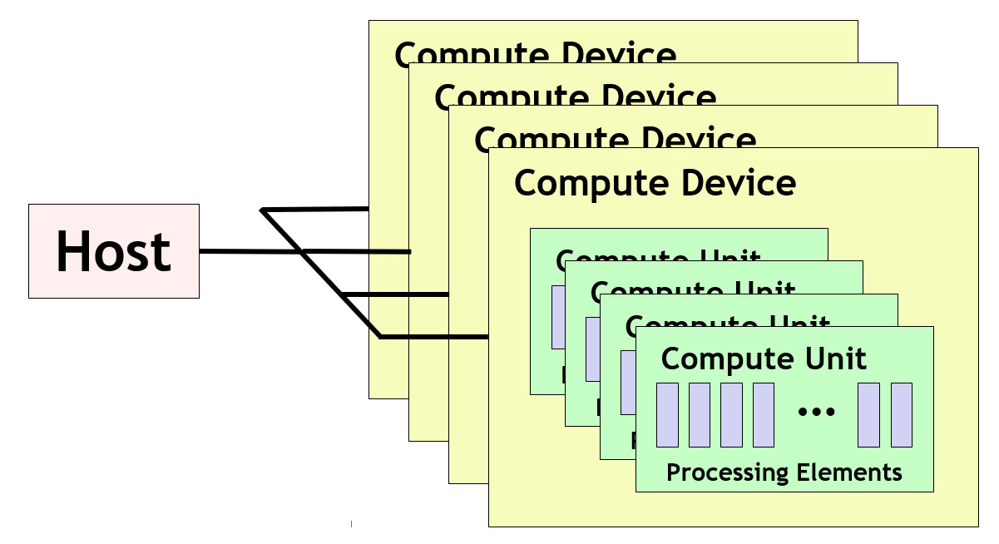
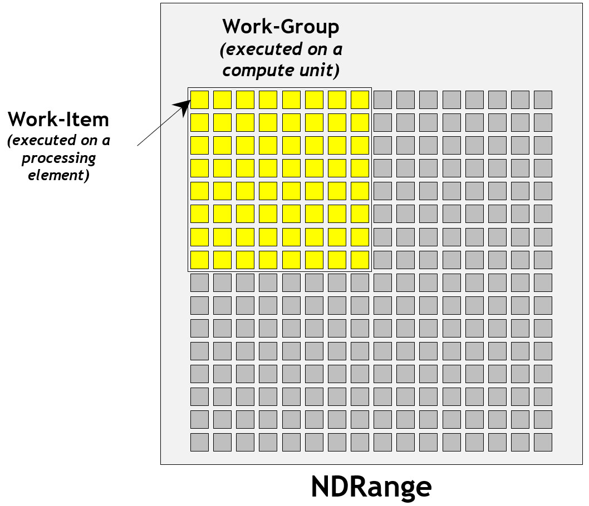
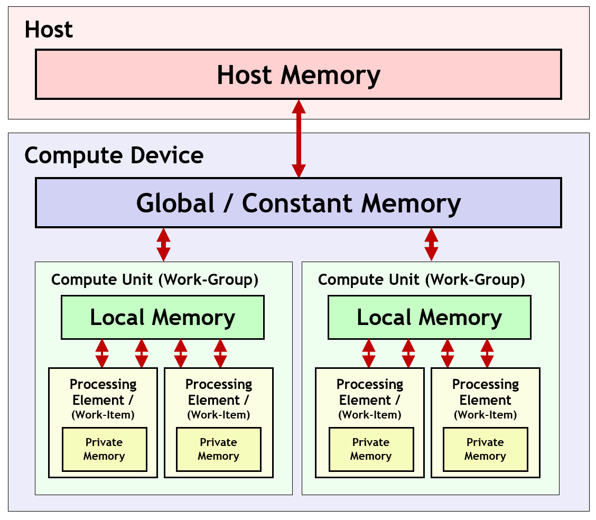

# OpenCL Programming Model

To understand how to program OpenCL in more detail let's consider the Platform, Execution and Memory Models. The three models interact and define OpenCL's essential operation.

## Platform Model

The OpenCL *Platform Model* describes how OpenCL understands the compute resources in a system to be topologically connected.

A *host* is connected to one or more OpenCL *compute devices*. Each compute device is collection of one or more *compute units* where each compute unit is composed of one or more *processing elements*. Processing elements execute code with SIMD (Single Instruction Multiple Data) or SPMD (Single Program Multiple Data) parallelism.

<b>OpenCL Platform Model</b>

For example, a compute device could be a GPU. Compute units would then correspond to the streaming multiprocessors (SMs) inside the GPU, and processing elements correspond to individual streaming processors (SPs) inside each SM. Processors typically group processing elements into compute units for implementation efficiency through sharing instruction dispatch and memory resources, and increasing local inter-processor communication.

## Execution Model

It is possible to use the OpenCL *enqueueTask* command to send a single-threaded kernel to a device. However, in many cases it can be far more efficient to initiate multiple threads that operate across the elements of a data structure in parallel - for example the scalars in a vector, or pixels in an image.

OpenCL's *enqueueNDRangeKernel* command enables a single kernel program to be initiated to operate in parallel across an N-dimensional data structure. Using a two-dimensional image as a example, the size of the image would be the *NDRange*, and each pixel is called a *work-item* that a copy of kernel running on a single processing element will operate on.

As we saw in the Platform Model section above, it is common for processors to group processing elements into compute units for execution efficiency. Therefore, when using the enqueueNDRangeKernel command, the program specifies a *work-group size* that represents groups of individual work-items in an NDRange that can be accommodated on a compute unit. Work-items in the same work-group are able to share local memory, synchronize more easily using work-group barriers, and cooperate more efficiently using work-group functions such as *async_work_group_copy* that are not available between work-items in separate work-groups.

<b>A 2D Image as an Example NDRange</b>

## Memory Model

OpenCL has a hierarchy of memory types:

* Host memory - available to the host CPU

* Global/Constant memory - available to all compute units in a compute device

* Local memory - available to all the processing elements in a compute unit 

* Private memory - available to a single processing element

<b>OpenCL Memory Model</b>

OpenCL memory management is explicit. None of the above memories are automatically synchronized and so the application explicitly moves data between memory types as needed.