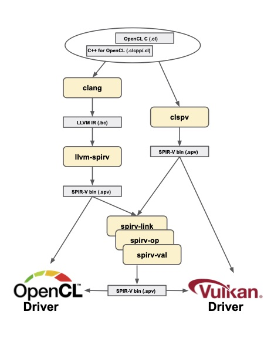

# Offline Compilation of OpenCL Kernel Sources

Aside from online compilation during application execution, OpenCL kernel sources can be compiled offline into binaries that can be loaded into the drivers using special API calls (e.g. `clCreateProgramWithBinary` or `clCreateProgramWithIL`).

This section describes available open source tools for offline compilation of OpenCL kernels.

## Open Source Tools

* [clang](https://clang.llvm.org/) is a compiler front-end for the C/C++ family of languages, including OpenCL C and C++ for OpenCL. It can produce executable binaries (e.g. AMDGPU), or portable binaries (e.g. SPIR). It is part of [the LLVM compiler infrastructure project](https://llvm.org/), and there is information regarding [OpenCL kernel language support and standard headers](https://clang.llvm.org/docs/UsersManual.html#opencl-features).
* [SPIRV-LLVM Translator](https://github.com/KhronosGroup/SPIRV-LLVM-Translator) provides a library and the __llvm-spirv__ tool for bidirectional translation between LLVM IR and SPIR-V. 
* [clspv](https://github.com/google/clspv) compiler and [clvk](https://github.com/kpet/clvk) runtime layer enable OpenCL applications to be executed with Vulkan drivers.
* [SPIR-V Tools](https://github.com/KhronosGroup/SPIRV-Tools) provide a set of utilities to process SPIR-V binaries including __spirv-opt__ optimizer, __spirv-link__ linker, __spirv-dis__/__spirv-as__ (dis-)assembler, and __spirv-val__ validator.

### Compiling Kernels to SPIR-V

The open source tools can be used to perform full compilation from OpenCL kernel sources into SPIR-V.

<p align="center">
<br>

<br> <br>
  <b>Offline compilation flow for OpenCL kernels into SPIR-V</b>
<br> <br>
</p>

When tools are used to target OpenCL drivers they operate on OpenCL flavor of SPIR-V and when tools target Vulkan drivers they operate on Vulkan flavor of SPIR-V instead. Some tools can ingest both SPIR-V dialects. However, it is generally not possible to transform or mix the modules of different SPIR-V flavors. For example, it is generally not possible to use __spirv-link__ to link the modules in both OpenCL and Vulkan formats of SPIR-V.

#### Examples

If you want to try the above compilation flow for yourself, after installing the tools, you can use the following commands.

##### Compile for OpenCL runtime

__(i)__ Compiling OpenCL C/C++ for OpenCL file into SPIR flavor LLVM IR (for 32 bit targets) formats:

```
clang -c -target spir -O0 -emit-llvm -o test.bc test.cl
```
Using `-cl-std` changes the language version compiled for.

To compile C++ for OpenCL source pass `-cl-std=CLC++` or use the file extension `.clcpp`.

```
clang -cl-std=CLC++ -c -target spir -O0 -emit-llvm -o test.bc test.cl
clang -c -target spir -O0 -emit-llvm -o test.bc test.clcpp
```
If debugging support is needed then the `-g` flag can be used in the clang invocation:

```
clang -c test.cl -target spir -o test.bc -g
```

__Note:__ In clang releases up to 12.0, calling most builtin functions requires the extra flags `-Xclang -finclude-default-header` to be passed to clang. Refer to the release documentation for more details.

__(ii)__ Converting LLVM IR into SPIR-V. 

```
llvm-spirv test.bc -o test.spv
```

__Note:__ Converting IR produced with optimization levels other than `-O0` is only available as an experimental feature and it is not guaranteed to work. In the majority of cases, the conversion is expected to succeed when optimizations are enabled. Developers are encouraged to file a bug report when issues are encountered. As a workaround when encountering an issue in translating modules obtained with optimizations, generate LLVM IR with optimizations disabled, and then use the stand-alone __spirv-opt__ tool to optimize at the SPIR-V level.

__(iii)__ Linking multiple modules can be done on LLVM IR level by passing multiple `.bc` files to __llvm-link__.

```
llvm-link test1.bc test2.bc -o app.bc
llvm-spirv app.bc -o app.spv
```
Alternatively, __spirv-link__ can be used to link SPIR-V modules of the same flavor either OpenCL or Vulkan:

```
spirv-link -o app.spv test1.spv test2.spv
```

__(iv)__ Once the SPIR-V binary is produced, it can be loaded in OpenCL applications using the `clCreateProgramWithIL` API call.

##### Compile for Vulkan runtime

Compiling OpenCL sources directly to SPIR-V binary format:

```
clspv test.cl -o test.spv
```

The SPIR-V binary files can be further optimized or linked using __spirv-opt__ and __spirv-link__ respectively before loading into the Vulkan runtime using `vkCreateShaderModule` from Vulkan API or (if [clvk](https://github.com/kpet/clvk) is used) `clCreateProgramWithIL` from OpenCL API.
