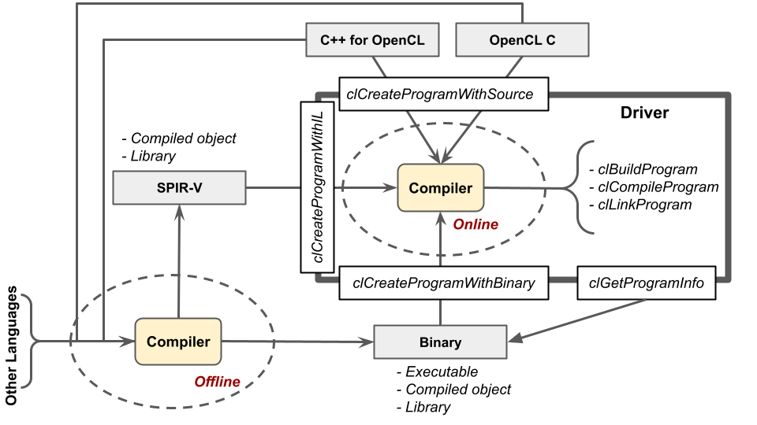
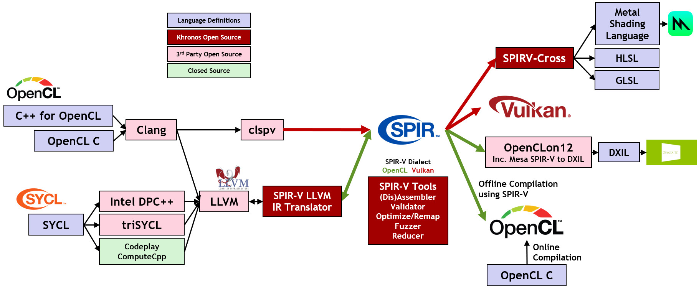

# Programming OpenCL Kernels

An OpenCL application is split into host code and device kernel code. Host code is typically written using a general programming language such as C or C++ and compiled by a conventional compiler for execution on the host CPU. OpenCL bindings for other languages are also available, such as Python.

Device kernels that are written in OpenCL C, which is based on C99, can be ingested and compiled by the OpenCL driver during execution of an application using runtime OpenCL API calls. This is called *online* compilation and is supported by all OpenCL drivers. OpenCL C is a subset of ISO C99 with language extensions for parallelism, well-defined numerical accuracy (IEEE 754 rounding with specified max error) and a rich set of built-in functions including cross, dot, sin, cos, pow, log etc.

 

   
  <b>Traditional Versus OpenCL Programming Using OpenCL C Kernels</b>
   

The OpenCL specification also enables optional *offline* compilation where the kernel program is compiled into a machine binary format that a particular driver can ingest. OpenCL implementations may use proprietary binary formats - and so offline compilation can be less portable than using online compilation of OpenCL C.

To offset this portability problem, and to enable a richer language and compiler ecosystem, Khronos has defined a cross-vendor, portable intermediate program representation called [SPIR-V](https://www.khronos.org/spir/). An increasing number of OpenCL implementations are supporting ingestion of offline-compiled kernel programs in the SPIR-V format.

SPIR-V enables independent innovation by the compiler and silicon communities. Compiler front ends that generate SPIR-V kernels that can be ingested and executed by any OpenCL driver that understands the SPIR-V format. For example the  [C++ for OpenCL](cpp_for_opencl.md) open source front-end and compilers for SYCL can generate SPIR-V code.

 

   
  <b>Online vs Offline Compilation of Kernels</b>
   

SPIR-V also enables OpenCL kernels written in OpenCL C and C++ for OpenCL to be executed by runtimes other than OpenCL, providing more deployment flexibility for developers that have invested in OpenCL kernel programming. For example, the Google [clspv](https://github.com/google/clspv) open source compiler can generate Vulkan SPIR-V shaders from OpenCL C kernel source code, Microsoft is working on a compiler chain that can ingest [OpenCL SPIR_V kernels into DX12](https://github.com/microsoft/OpenCLOn12), and there is early work on using SPIR-V tools such as SPIRV-Cross to bring OpenCL SPIR-V kernels into Metal for execution on Apple platforms.

This diverse OpenCL language ecosystem in turn gives a rich choice to domain specific languages, such as the Halide image processing framework, that can compile to OpenCL C kernels either using source-to-source translations or generating SPIR-V.

 

   
  <b>OpenCL Language Ecosystem Enabled With SPIR-V</b>
   

