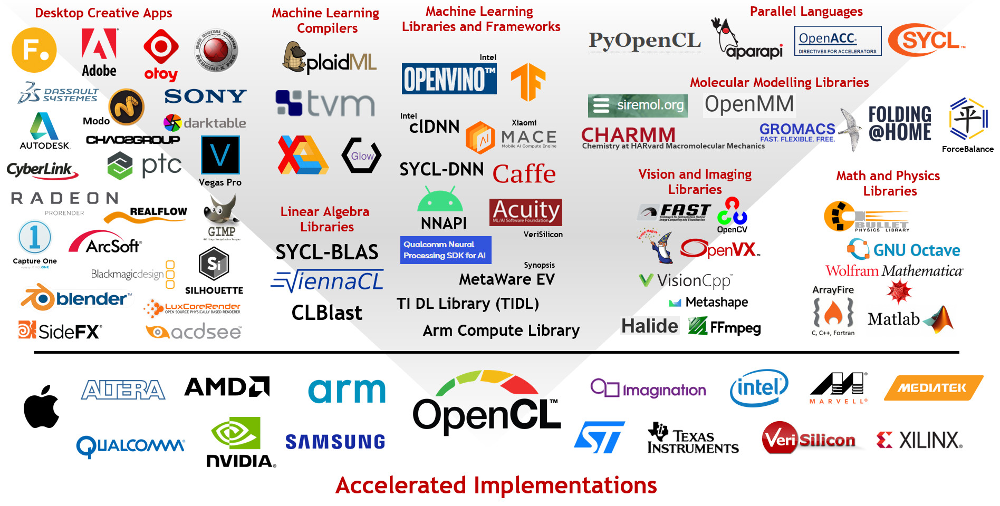

# What is OpenCL?

OpenCL (Open Computing Language) is an open, royalty-free standard for cross-platform, parallel programming of diverse accelerators found in supercomputers, cloud servers, personal computers, mobile devices and embedded platforms. OpenCL was created and is managed by the Khronos Group. OpenCL makes applications run faster and smoother by enabling them to use the parallel processing power in a system or device.

OpenCL is widely used throughout the industry. Many silicon vendors ship OpenCL with their processors, including GPUs, DSPs and FPGAs. The OpenCL API specification enables each chip to have to have its OpenCL drivers tuned to its specific architecture. Having the same, standardized API available on many systems enable developers to widely deploy their applications to reach more customers while minimizing porting and support costs. 

To say they support conformant OpenCL, hardware vendors must become OpenCL *Adopters* and submit their conformance test results for review by the OpenCL Working Group at Khronos. You can  view a list of hardware vendors with Conformant OpenCL Implementations on [Khronos' OpenCL Adopter Page](https://www.khronos.org/conformance/adopters/conformant-products/opencl).

 

   
  <b>OpenCL is widely deployed and used throughout the industry</b>
   

By enabling applications to tap into the power of accelerated parallel programming, OpenCL greatly improves the speed and responsiveness of a wide range of applications, engines and libraries - including professional creative tools, scientific and medical software, vision processing, and neural network training and inferencing. 

As well as being programmed directly by developers, OpenCL is also increasingly being used as a backend target for languages, compilers and machine learning stacks that need a portable API to reach into hardware acceleration for generated code.

You can find a [list of applications that use OpenCL on Wikipedia.](https://en.wikipedia.org/wiki/List_of_OpenCL_applications)

